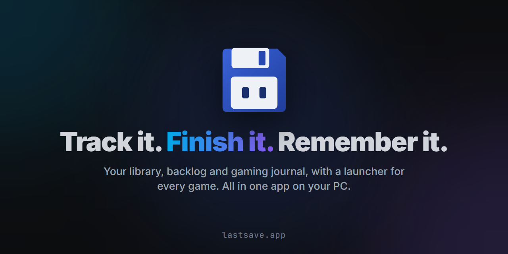
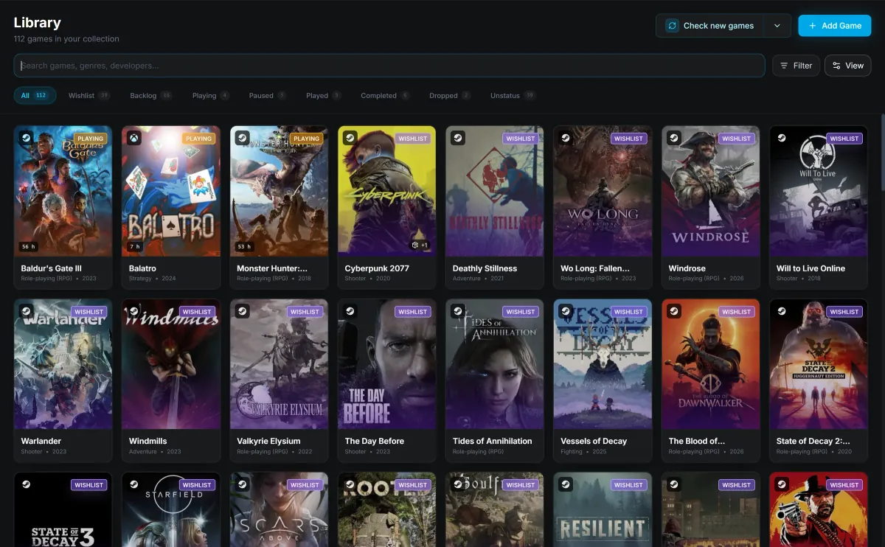
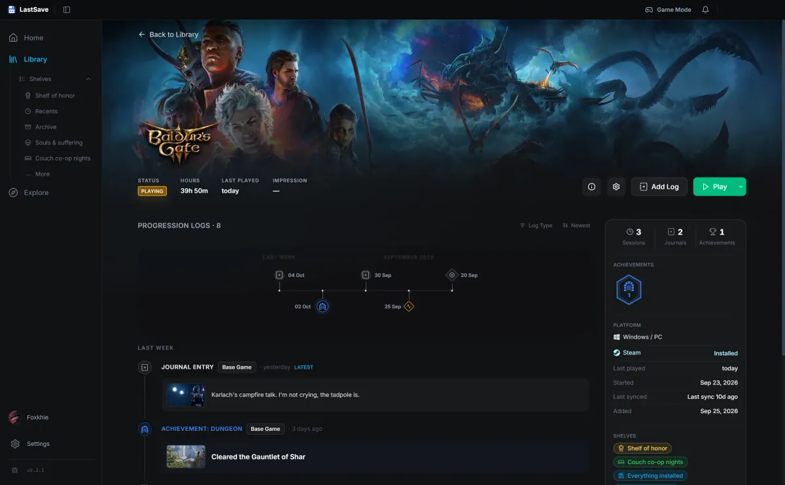
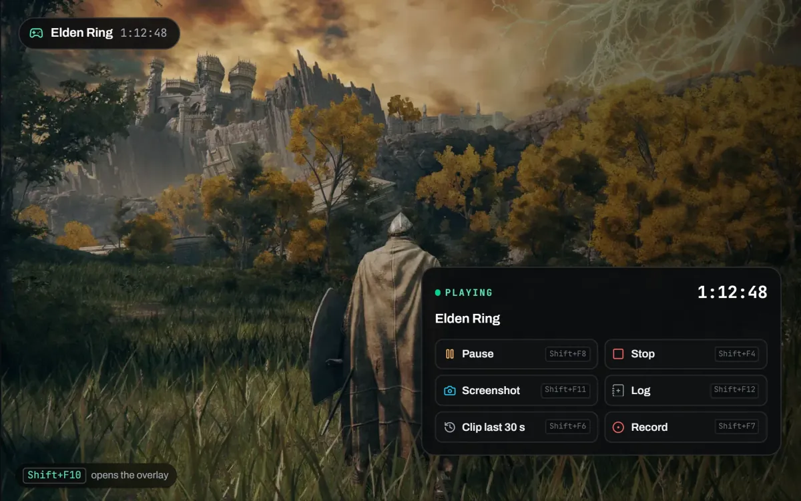

**A desktop app for your gaming life:** what you own, what you're playing, what you finished,
and what happened along the way. All in one app on your PC.

 

> **Beta.** LastSave is being built in the open with a small group of players. Things will change,
> and some of them will break. Tell us when they do. 💙

## 💾 What it does

<table>
<tr>
<td width="50%" valign="top">

**Your library, not a spreadsheet.** 
Everything you own or want to play, with cover art, filters and shelves you make yourself. Import
from Steam, Epic, your installed PC games, or an emulator library.

</td>
<td width="50%" valign="top">

**A record, not a checklist.** 
Status changes, play sessions, journal entries with screenshots and clips, achievements — a
timeline per game instead of a percentage.

</td>
</tr>
<tr>
<td></td>
<td></td>
</tr>
<tr>
<td width="50%" valign="top">

**It notices.** 
Start a game you track and LastSave times the session on its own, with an in-game overlay for
logging, screenshots and clips without alt-tabbing out.

</td>
<td width="50%" valign="top">

**Yours, on your machine.** 
Your library is a database on your own PC, and LastSave works without a connection. Anything that
sends data out is something you turn on.

</td>
</tr>
<tr>
<td></td>
<td align="center" valign="middle">

**[See everything on lastsave.app →](https://lastsave.app)**

</td>
</tr>
</table>

## ⬇️ Download

**[Download for Windows →](https://lastsave.app/download?ref=github)** · Windows 10 and 11, 64-bit.
Nothing to configure — install it and open it. LastSave updates itself.

The installer is not code-signed yet, so Windows will show a blue **"Windows protected your PC"**
screen the first time you run it. That is SmartScreen saying it does not recognise the publisher,
not that anything is wrong with the file. Choose **More info**, then **Run anyway**.

Every version and its notes are in [**Releases**](https://github.com/LastSaveApp/lastsave/releases).

## 💬 Community and help

| | |
|---|---|
| 💬 [**Discord**](https://discord.gg/cgTuQXwvA4) | Where most of it happens: help, ideas, and people who play too much |
| 🐞 [**Issues**](https://github.com/LastSaveApp/lastsave/issues/new/choose) | Bugs and requests, if you prefer GitHub to Discord |
| 🗨️ [**Discussions**](https://github.com/LastSaveApp/lastsave/discussions) | Questions, ideas and show-and-tell |
| ☕ [**Ko-fi**](https://ko-fi.com/lastsaveapp) | Help keep LastSave free and moving |

You can also report a bug from inside the app — **Settings → About → Report a bug or send
feedback** — which attaches the log for you.

The application source is not public. Translations, and later the Gaming Mode themes, will live
here so they can be contributed.

## 🔒 Privacy, briefly

LastSave keeps your library in a database on your own machine, and works without a connection.
Anything that sends data out is something you turn on. The full terms and privacy policy are in
the app, under **Settings → About**, and at [lastsave.app](https://lastsave.app).

---

© LastSave · Built by one developer, with a small group of players · Game metadata and artwork
come from <a href="https://www.igdb.com/">IGDB</a>.
  
If LastSave helps you remember your games, a ⭐ on this repository helps other players find it.

